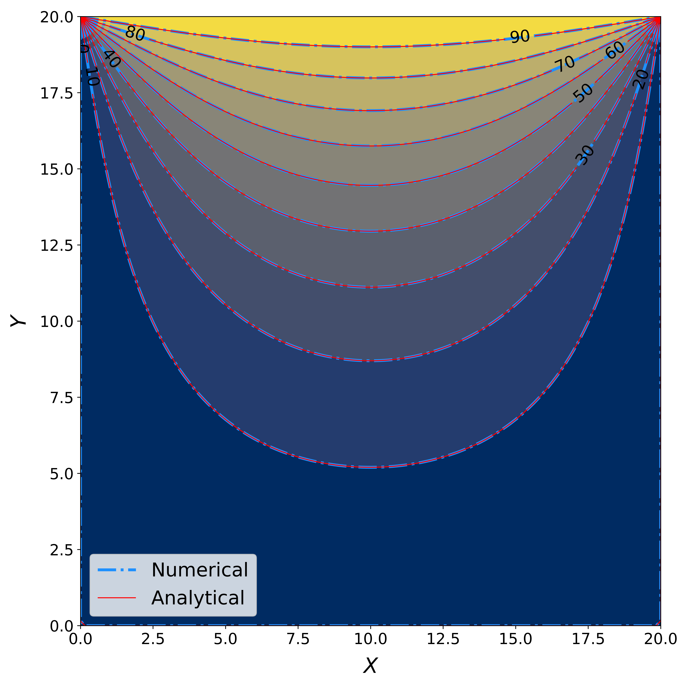
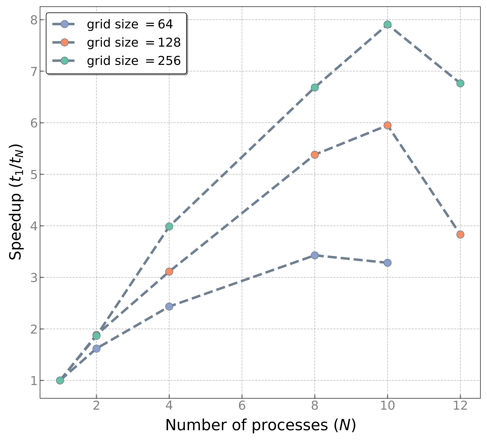

# mpiHeatEquation

## Abstract
Overall, MPI parallelization is a powerful tool for improving the efficiency and accuracy of heat conduction simulations, and it has numerous applications in various fields of engineering and science. Here, we are presenting the parallelized solution of the two-dimensional heat conduction equation on a square plate. We leverage collective communications and certain MPI functions to achieve convergence to the analytical solution. Metrics of scalability are widely used to illustrate the ability of both hardware and software to deliver greater compute with more hardware. Thus, we will also perform a weak and a strong scaling analysis of our program.

### Theory
For the numerical solution, we time-match:

$\frac{\partial \theta}{\partial t}=\kappa\left(\frac{\partial^2 \theta}{\partial x^2}+\frac{\partial^2 \theta}{\partial y^2}\right)$

to a steady-state solution on a uniform mesh, with the following finite difference approximation:

$\frac{\theta_{i, j}^{t+1}-\theta_{i, j}^t}{\delta \mathrm{t}}=\left(\frac{\theta_{i+1, j}^t-2 \theta_{i, j}^t+\theta_{i-1, j}^t}{\delta x^2}+\frac{\theta_{i, j+1}^t-2 \theta_{i, j}^t+\theta_{i, j-1}^t}{\delta \mathrm{y}^2}\right)$

As for the analytical solution, this is given by the Fourier series:

$\theta(x, y)=\sum_{n=1,3,5, \ldots}^{\infty} \frac{4 \theta_N}{n \pi} \sin \left(\frac{n \pi x}{L}\right) \sinh \left(\frac{n \pi y}{L}\right) / \sinh (n \pi)$,

which is asymptotically correct. $L$ is the length of the plate’s edge and $\theta_{N}$ is the constant temperature on the plate’s top side. Regarding time-stepping and numerical stability, we made sure that $\mathrm{dt}<0.25 \mathrm{dx}^2 / \kappa$.

## Results

### Numerical and Analytical Solutions Comparison

Surface Plot            |  Contour Plot
:-------------------------:|:-------------------------:
  |  

### Strong Scaling

Speedup            |  Time
:-------------------------:|:-------------------------:
  |  

