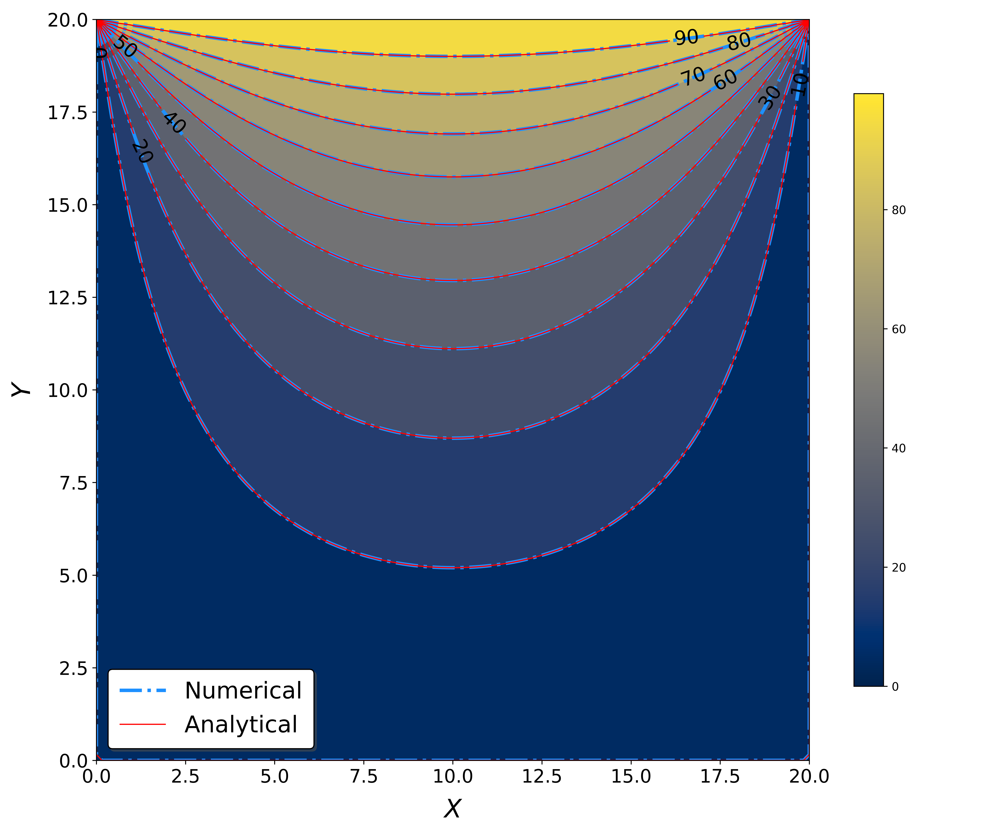
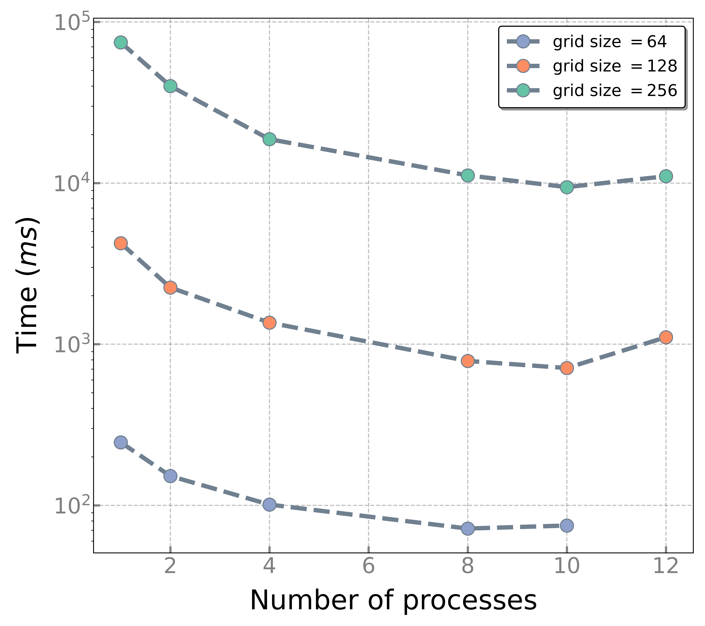

# mpiHeatEquation

## Abstract

Overall, MPI parallelization is a powerful tool for improving the efficiency and accuracy of heat conduction simulations, and it has numerous applications in various fields of engineering and science. Here, we are presenting the parallelized solution of the two-dimensional heat conduction equation on a square plate. We leverage collective communications and certain MPI functions to achieve convergence to the analytical solution. Metrics of scalability are widely used to illustrate the ability of both hardware and software to deliver greater compute with more hardware. Thus, we will also perform a weak and a strong scaling analysis of our program.

### Results

#### Monolingual vs. Bilingual GPT-2 Experiment: Model perplexity as a function of weight deletion

#### Linear Representation Visual Model Experiments: MSE as a function of additive noise on model weights

##### MNIST dataset
